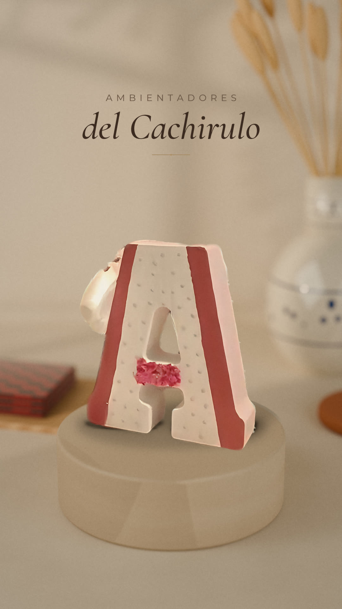

# Spots verticales · Alldesign Karl

| Spot | Archivo | Detalles |
|---|---|---|
| **Letras decorativas · giro 360°** (20,0 s) | [`Letras_Decorativas_1080x1920.mp4`](Letras_Decorativas_1080x1920.mp4) | [`letras_decorativas/README.md`](letras_decorativas/README.md) |
| Letras decorativas · solo fotos (20,0 s) | [`Letras_Decorativas_fotos_1080x1920.mp4`](Letras_Decorativas_fotos_1080x1920.mp4) | ídem |
| Ambientadores del Cachirulo (20,5 s) | [`Ambientadores_del_Cachirulo_1080x1920.mp4`](Ambientadores_del_Cachirulo_1080x1920.mp4) | abajo |

---

# Ambientadores del Cachirulo · Spot vertical

Anuncio vertical de **20,5 s** (1080×1920, 30 fps, H.264 + AAC) para los Ambientadores del Cachirulo,
creado a partir del vídeo de referencia (`VID-20261004-WA0008.mp4`).

**Archivo final:** [`Ambientadores_del_Cachirulo_1080x1920.mp4`](Ambientadores_del_Cachirulo_1080x1920.mp4)

## Qué se ha hecho

| Petición | Resultado |
|---|---|
| Eliminar a la niña | La letra se ha recortado frame a frame con SAM 2.1 (segmentación de vídeo). De la grabación original solo queda el producto: ni la niña, ni las manos, ni el plato, ni sombras o reflejos de ella. El hueco de la «A» y la abertura entre sus patas también se han vaciado, para que a través de ellos se vea el fondo nuevo y no la camiseta original. |
| Producto protagonista, girando lento | Se ha medido el ángulo de giro real de la letra en cada frame y se ha retemporizado con interpolación (RIFE). La letra gira despacio y de forma continua (~2,5°/s) mostrando solo su cara decorada con flores: empieza casi de frente y termina en 3/4, con las zapatillas de ballet y el lazo de organza a la vista. Se han evitado los perfiles laterales y las vistas oblicuas, donde el vídeo original solo muestra paredes lisas o zonas borrosas. También se compensan el zoom y el movimiento de la cámara del móvil, para que la letra gire en su sitio sobre la peana. |
| Fondo artesanal aragonés | Escena de estudio renderizada en 3D (Blender Cycles): pared de cal con luz de ventana y sombras de olivo, peana de travertino, mantel de lino, jarra de cerámica estilo Muel con espigas secas y un cachirulo doblado. Tonos crema y beige con desenfoque óptico real. |
| Calidad | Fusión multi-fotograma (cada imagen se alinea con sus 6 vecinas por flujo óptico y se combinan, lo que elimina el ruido y los bloques de compresión de WhatsApp), super-resolución Real-ESRGAN ×4, pase de nitidez fina y refinado de bordes guiado por la imagen, sin halos. Codificación H.264 de alta calidad (CRF 16). Las proporciones y el diseño de la letra se mantienen intactos. |
| Iluminación y cámara | La letra proyecta sombra de contacto y una sombra suave coherente con la luz de la escena. El acercamiento de cámara (dolly-in) usa el mapa de profundidad del render, así que hay paralaje real. Lleva etalonaje cálido y viñeta suave. |
| Voz | Locución femenina en español de España (síntesis neuronal Kokoro, voz `ef_dora`), procesada con ecualización, compresión y una sala muy sutil. Comprobada con Whisper: se transcribe palabra por palabra. |
| Música | Composición original para este spot en 3/4 con aire de jota aragonesa: guitarra española punteada, melodía de guitarra, cuerdas suaves y arpa. Entra y sale con fundido y baja automáticamente bajo la voz. |
| Mezcla | -14 LUFS integrados y pico de -1,2 dB, el estándar de Instagram, TikTok y YouTube. |

## Guion de la locución

> Estos son los Ambientadores del Cachirulo.
> Elaborados de forma artesanal, con pulverizador de diez mililitros.
> En exclusiva, en nuestras tiendas colaboradoras:
> Mercería El Siglo, en Cortes de Aragón, cuarenta y seis.
> Y Papelería Casablanca, en calle La Vía, dieciséis.
> Descúbrelos. Te esperamos.

## Estructura

| Tiempo | Imagen y rótulos | Voz |
|---|---|---|
| 0,0–3,3 s | Fundido de entrada. La «A» floral casi de frente empieza a girar despacio. Título: *AMBIENTADORES / del Cachirulo* | «Estos son los Ambientadores del Cachirulo.» |
| 3,3–7,6 s | *Elaborados de forma artesanal* · *CON PULVERIZADOR DE 10 ML INCLUIDO* | «Elaborados de forma artesanal, con pulverizador de diez mililitros.» |
| 7,7–17,5 s | *DISPONIBLE EXCLUSIVAMENTE EN TIENDAS COLABORADORAS* · *Mercería El Siglo — C. Cortes de Aragón 46* · *Papelería Casablanca — C. La Vía 16* | Tiendas y direcciones |
| 17,6–20,5 s | La letra en 3/4 con las zapatillas y el lazo, todavía girando. *Descubre los Ambientadores del Cachirulo* · *Te esperamos*. Fundido a negro y la música se apaga. | «Descúbrelos. Te esperamos.» |

## Notas importantes

- **Pulverizador de 10 ml:** no aparece en el vídeo de referencia. Para no inventar su aspecto, se menciona
  en la voz y en un rótulo, pero no se muestra. Si se graba o fotografía el pulverizador, se puede
  añadir un plano suyo en el tramo 3–8 s.
- **Voz:** es una voz sintética de alta calidad, no una locutora real. Para una voz 100 % humana se
  puede grabar el mismo guion (dura unos 19 s) y sustituir la pista. La música y la mezcla ya están
  preparadas para ello (`audio/`).
- **Música:** composición original creada para este spot, libre de derechos de terceros.
- **Fondo:** es un render 3D fotorrealista, no una foto de stock ni una imagen generada por IA.

## Contenido del repositorio

- `Ambientadores_del_Cachirulo_1080x1920.mp4`: el spot final.
- `portada.jpg`: fotograma de portada (título), para usarlo como miniatura.
- `audio/`: pistas separadas de voz, música y mezcla final (FLAC 48 kHz).
- `pipeline/`: scripts usados (segmentación, análisis del giro, escalado, escena 3D, composición, música y mezcla).
